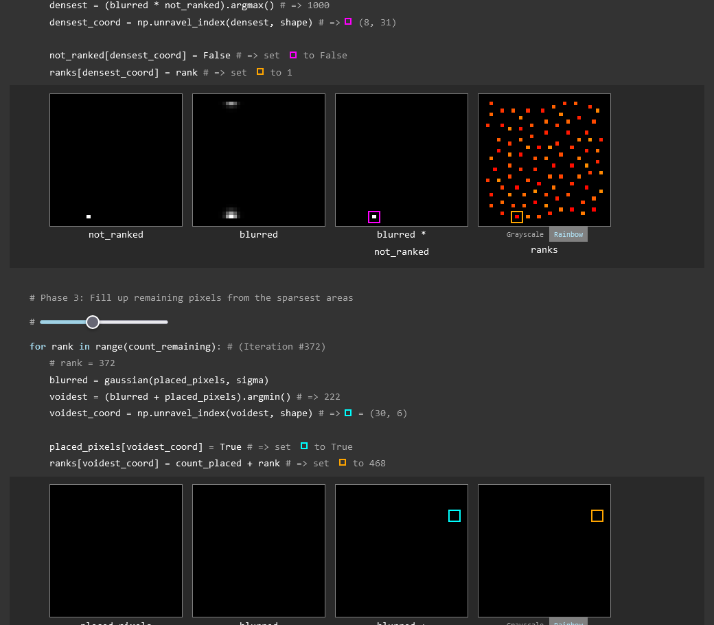

#  Blue Noise

[Live Version](https://static.laszlokorte.de/blue-noise/)

This is an interactive demonstration of the Void and Cluster algorithm for generating blue noise. There are already plenty of excellent explorations on how and why to generate blue noise, and noises of other color. The Void and Cluster algorithm is one of several promiment algorithms. Some advantages over other algorithms are that the blue noise is of very good quality and that only the first step in the algorithm is non-deterministic.
This page

The goal of this page is to provide additional insight by visualizing the core idea of this algorithm.

This insight might be used to better unstand the algorithm itself, for example to recognize potential performance improvements. But it might also be used as source of inspiration on how to design a custom algorithm.

The algorithm below is implemented in python using numpy. In this regard it can also be used as a case-study on sophisticated algorithms that take multiple hundred lines in C++ can be written succinctly when relying on higher levels.

<h2>References</h2>

<ul>
	<li><a target="_blank" href="https://blog.demofox.org/2018/08/12/not-all-blue-noise-is-created-equal/">Not All Blue Noise is Created Equal</a></li>
	<li><a target="_blank" href="https://blog.demofox.org/2019/06/25/generating-blue-noise-textures-with-void-and-cluster/">Generating Blue Noise Textures With Void And Cluster</a></li>
	<li><a target="_blank" href="http://momentsingraphics.de/BlueNoise.html">Free blue noise textures</a></li>
	<li><a target="_blank" href="https://dl.acm.org/doi/10.1145/127719.122736">Mitchell's Best Candidate Algorithm</a></li>
	<li><a target="_blank" href="https://ieeexplore.ieee.org/document/3288/">Dithering with blue noise</a></li>
	<li><a target="_blank" href="https://blog.demofox.org/2017/10/20/generating-blue-noise-sample-points-with-mitchells-best-candidate-algorithm/">Generating Blue Noise Sample Points With Mitchell’s Best Candidate Algorithm</a></li>
	<li><a target="_blank" href="https://blog.demofox.org/2017/10/25/transmuting-white-noise-to-blue-red-green-purple/">Transmuting White Noise To Blue, Red, Green, Purple</a></li>
	<li><a target="_blank" href="https://observablehq.com/@bensimonds/mitchells-best-candidate-algorithm">Mitchell's Best Candidate Algorithm</a></li>
	<li><a target="_blank" href="http://momentsingraphics.de/3DBlueNoise.html">The problem with 3D blue noise</a></li>
</ul>